# Домашнее задание к занятию 1 «Введение в Ansible» - Илларионов Дмитрий

ДЗ выполнял на ВМ в облаке, которую ставил через терраформ - см. код в папке trr .
Почему ansible c контейнером на ubuntu не заработал?


## Подготовка к выполнению

1. Установите Ansible версии 2.10 или выше.
2. Создайте свой публичный репозиторий на GitHub с произвольным именем.
3. Скачайте [Playbook](./playbook/) из репозитория с домашним заданием и перенесите его в свой репозиторий.

## Основная часть

1. Попробуйте запустить playbook на окружении из `test.yml`, зафиксируйте значение, которое имеет факт `some_fact` для указанного хоста при выполнении playbook.

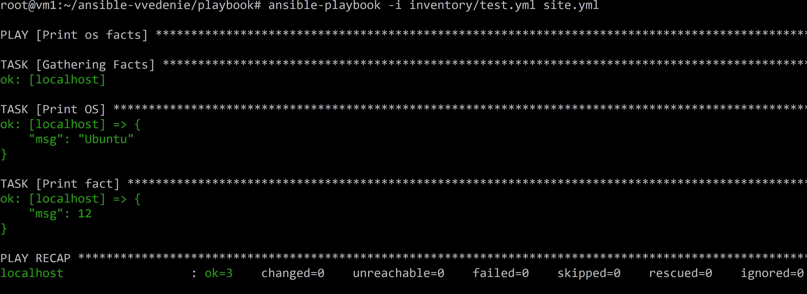

Есть код:

```
      - name: Print fact
        debug:
          msg: "{{ some_fact }}"
```

код выводит:

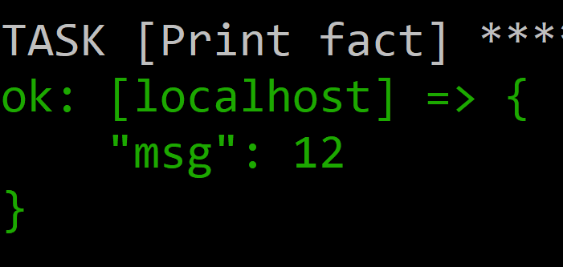

Потому что в инвентори для тест - нет групп deb и и др. а есть только группа inside .
Но в group_vars нет значения для переменной some_fact для группы inside, поэтому применяется значение для группы all:

```
  some_fact: 12
```  

2. Найдите файл с переменными (group_vars), в котором задаётся найденное в первом пункте значение, и поменяйте его на `all default fact`.

Выполнил, и попробовал применить:

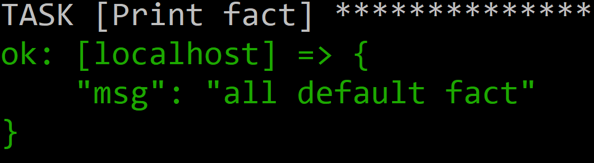

3. Воспользуйтесь подготовленным (используется `docker`) или создайте собственное окружение для проведения дальнейших испытаний.
4. Проведите запуск playbook на окружении из `prod.yml`. Зафиксируйте полученные значения `some_fact` для каждого из `managed host`.

ПО докер поставлено, но, сами контейнеры еще не запущены не развернуты, поэтому при запуске - ошибка:

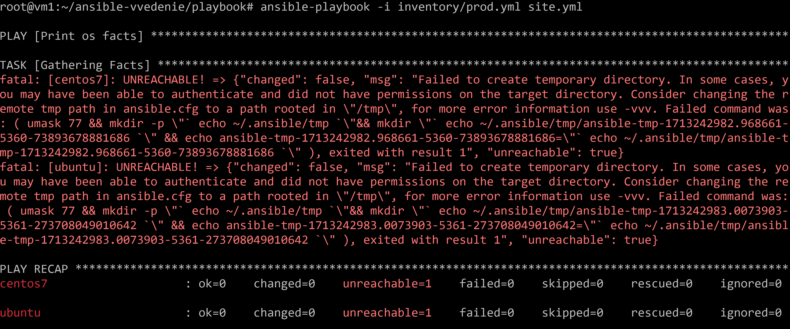

Запустил:


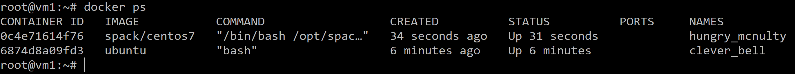

Переименовал контейнеры:
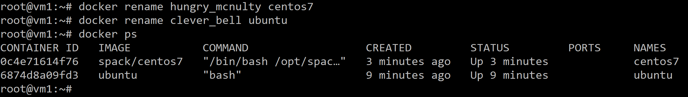

Еще раз запускаю:

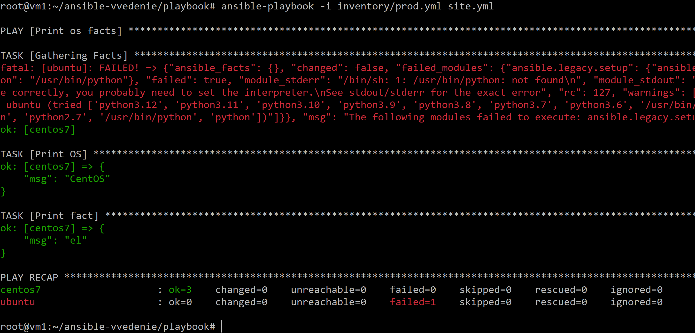

some_fact для centos7 = el потому что в инвенторе группа = el для centos7 и поэтому из group_vars взято значение для этой группы:

```
  some_fact: "el"
```  
А для ubuntu что-то пошло не так, и не смог с ней работать.

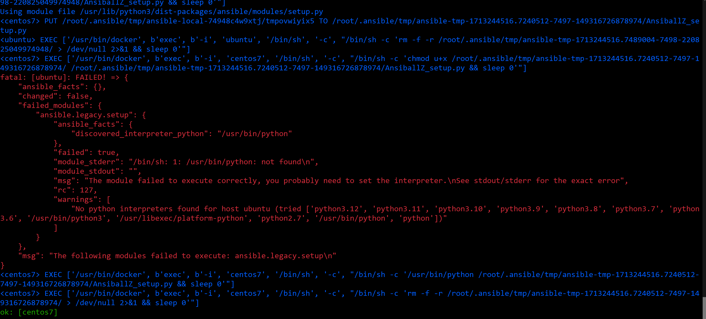

Причина что в контейнере для ubuntu нет питона.

установил питон для ubuntu:

Подключился к контейнеру:
```
docker exec -it bash ubuntu
```
Установил питон:
```
apt update
apt install python3
```
После этого все ок:

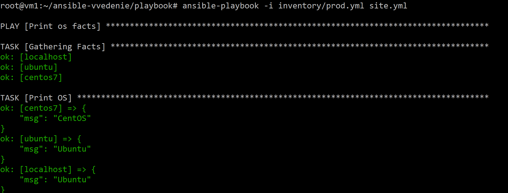


5. Добавьте факты в `group_vars` каждой из групп хостов так, чтобы для `some_fact` получились значения: для `deb` — `deb default fact`, для `el` — `el default fact`.
6.  Повторите запуск playbook на окружении `prod.yml`. Убедитесь, что выдаются корректные значения для всех хостов.

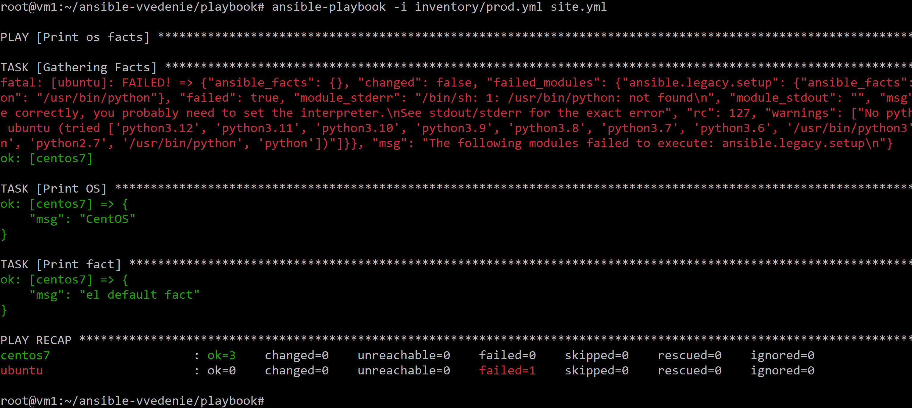

7. При помощи `ansible-vault` зашифруйте факты в `group_vars/deb` и `group_vars/el` с паролем `netology`.

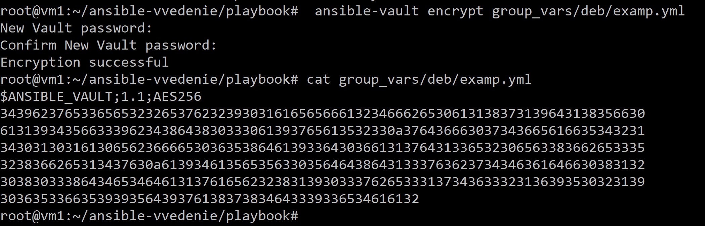

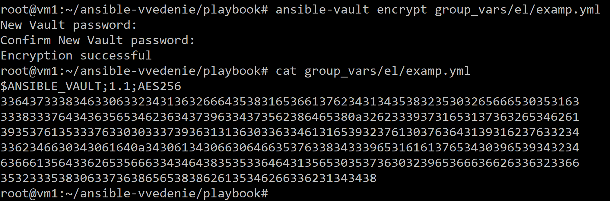


8. Запустите playbook на окружении `prod.yml`. При запуске `ansible` должен запросить у вас пароль. Убедитесь в работоспособности.

```
 ansible-playbook -i inventory/prod.yml site.yml --ask-vault-pass
```

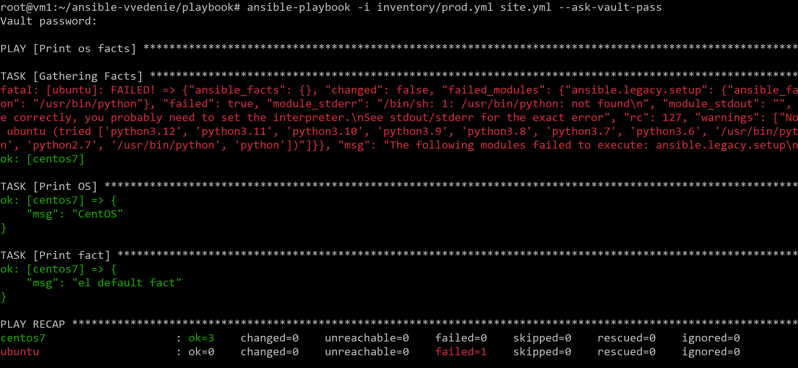


9. Посмотрите при помощи `ansible-doc` список плагинов для подключения. Выберите подходящий для работы на `control node`.


https://runebook.dev/ru/docs/ansible/plugins/connection
```
ansible-doc -t connection -l
```

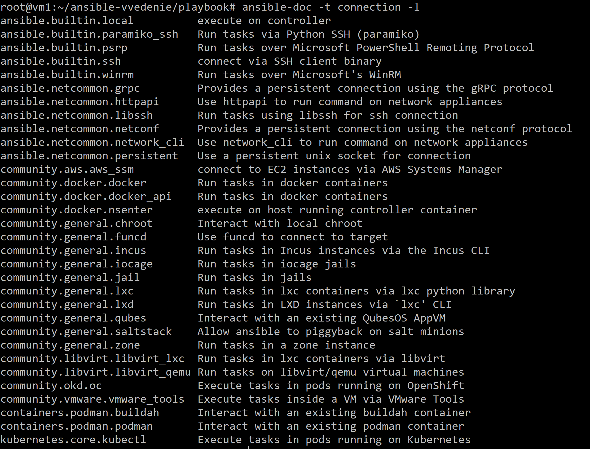

Не понял что именно нужно сделать по: "Выберите подходящий для работы на `control node`".
control node - это как я понимаю сервер с которого работает ансил, и может вызывать плагины.
Например можно выбрать ansible.builtin.ssh  

10. В `prod.yml` добавьте новую группу хостов с именем  `local`, в ней разместите localhost с необходимым типом подключения.


11. Запустите playbook на окружении `prod.yml`. При запуске `ansible` должен запросить у вас пароль. Убедитесь, что факты `some_fact` для каждого из хостов определены из верных `group_vars`.

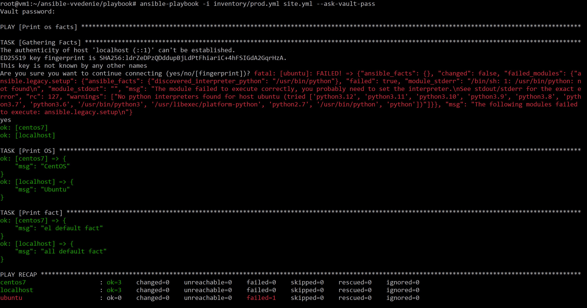

все верно.

12. Заполните `README.md` ответами на вопросы. Сделайте `git push` в ветку `master`. В ответе отправьте ссылку на ваш открытый репозиторий с изменённым `playbook` и заполненным `README.md`.

13. Предоставьте скриншоты результатов запуска команд.

## Необязательная часть

1. При помощи `ansible-vault` расшифруйте все зашифрованные файлы с переменными.

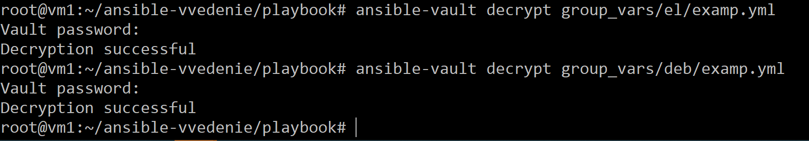

```
ansible-vault decrypt group_vars/el/examp.yml
```

2. Зашифруйте отдельное значение `PaSSw0rd` для переменной `some_fact` паролем `netology`. Добавьте полученное значение в `group_vars/all/exmp.yml`.

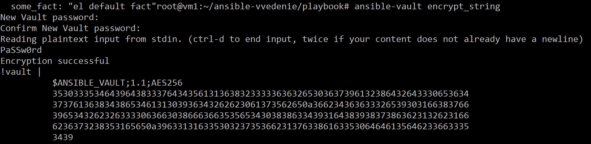

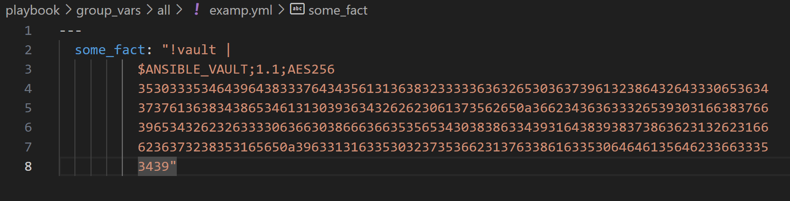

3. Запустите `playbook`, убедитесь, что для нужных хостов применился новый `fact`.

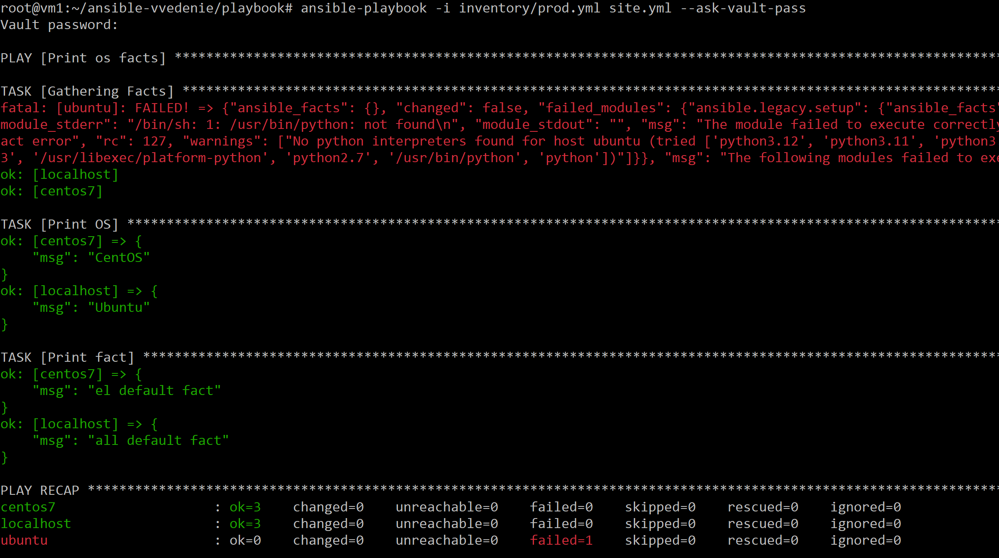

Про установку питона в ubuntu уже в конце решил, не на всех скринах там зеленое поэтому.
После исправления итоговый запуск где все ок:

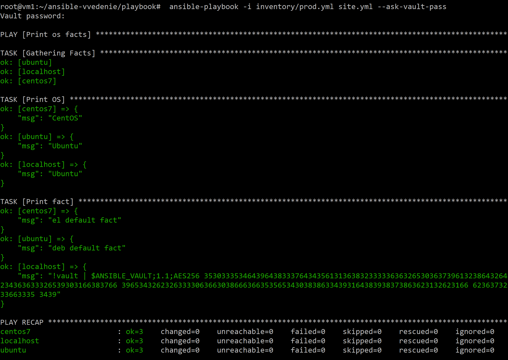


4. Добавьте новую группу хостов `fedora`, самостоятельно придумайте для неё переменную. В качестве образа можно использовать [этот вариант](https://hub.docker.com/r/pycontribs/fedora).


5. Напишите скрипт на bash: автоматизируйте поднятие необходимых контейнеров, запуск ansible-playbook и остановку контейнеров.


6. Все изменения должны быть зафиксированы и отправлены в ваш личный репозиторий.

---

### Как оформить решение задания

Выполненное домашнее задание пришлите в виде ссылки на .md-файл в вашем репозитории.

---
